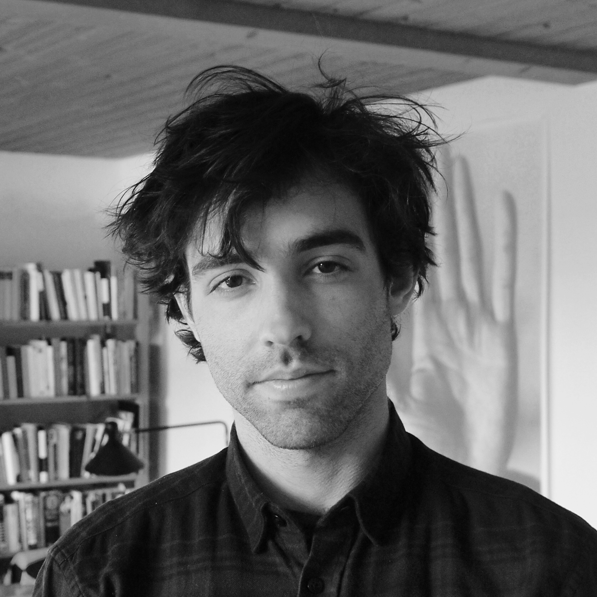

I am a Ramon y Cajal Associate Professor of political science at the [Universidad Carlos III de Madrid](https://www.uc3m.es/social-sciences-department/home) and a research fellow at the [Carlos III - Juan March Institute](https://ic3jm.es/).

My [research](./research.html) focuses on political violence. I use a variety of quantitative methods to understand social and political dynamics during violent conflicts and in their aftermath. My book project investigates the long-term consequences of civilian victimization and develops a new theory on how and under which circumstances violence leaves persistent legacies. Part of my research has been published at *The Journal of Politics*, *Comparative Political Studies*, and the *Journal of Peace Research*, among others.

I obtained my PhD from ETH Zurich, where I was part of the [International Conflict Research](https://icr.ethz.ch/) group.
I have been a visiting scholar at [ICS-Lisboa](https://www.ics.ulisboa.pt/) and [Georgetown University](https://government.georgetown.edu/).
