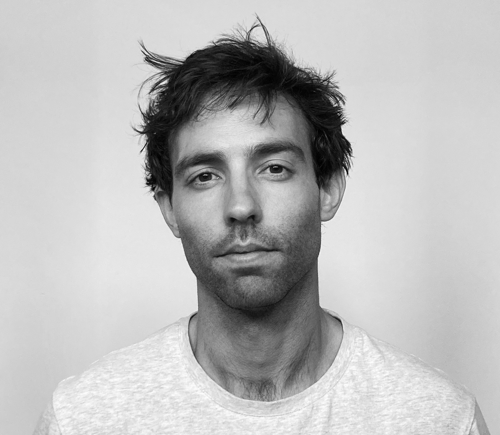

I am Ramon y Cajal Associate Professor of political science at the [Universidad Carlos III de Madrid](https://www.uc3m.es/social-sciences-department/home) and a member of the [Juan Linz Institute](https://ijlinz.es/en/).

My [research](./research.html) explores how political violence shapes societies and how societies shape the norms around its use. Methodologically, I use a variety of quantitative tools to understand the political legacies of violence, the consequences of post-conflict policies, and more recently, how the normative principles that societies hold about violence, rights, or democracy hold up when put to the test. My [book project](./book.html) develops a theory of how and when civilian victimization leaves persistent political legacies or fails to do so. Part of my research has been published at *The Journal of Politics*, *Comparative Political Studies*, *European Journal of Political Research*, and the *Journal of Peace Research*, among other outlets.

I obtained my PhD from ETH Zurich, where I was part of the [International Conflict Research](https://icr.ethz.ch/) group. I have been a visiting scholar at Georgetown University, Instituto de Ciências Sociais (Lisboa), and Instituto de Ciencia Política (UC Chile).
